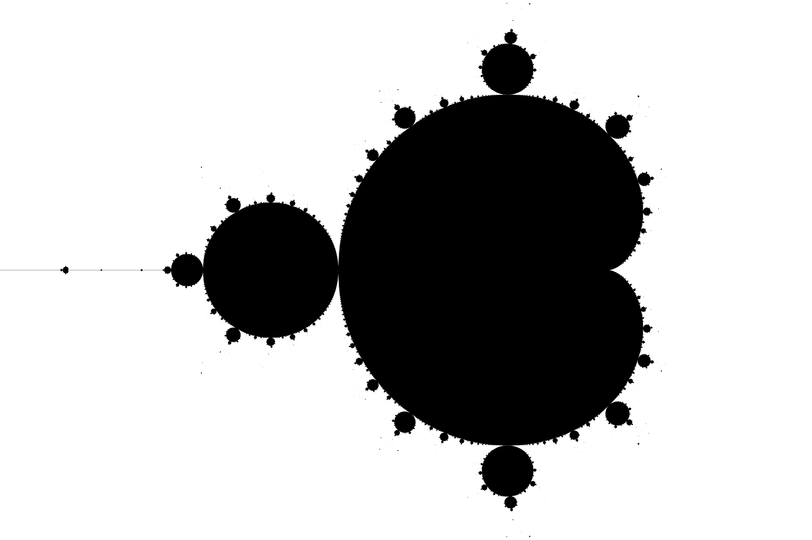

# Memoria del ejercicio voluntario: Representación del conjunto de mandelbrot

## Enunciado

Se pide que se implemente un programa para la representación del conjunto de Mandelbrot. Este programa deberá ser implementado con paralelismo por paso de mensajes. Para ayuda, se nos ofrecía el pseudo-código en la página 69 de las diapositivas del tema 3.

### Pseudo-código Maestro
```python
process Maestro ;
begin
for i := 0 to num_esclavos-1 do
	send( fila, Esclavo[i] ) ;
while queden filas sin colorear do
	select
		for j := 0 to n when receive( colores, Esclavo[j] ) do
			
			if quedan filas en la bolsa
				then send( fila, Esclavo[j] )
			else send( fin, Esclavo[j] );
			
			visualiza(colores);
	end
end
```

### Pseudo-código Esclavo
```python
process Esclavo[ i : 0..num_esclavos-1 ] ;
begin
	receive( mensaje, Maestro );
	
	while mensaje != fin do begin
		colores := calcula_colores(mensaje.fila) ;
		send (colores, Maestro );
		receive( mensaje, Maestro );
	end
end
```


## Código de la solución y resultado.

La solución implementada en c++, con uso de la librería openmpi y png++. Este código viene repartido en dos archivos adjuntos: dibujo-asterisco.cpp y dibujo.cpp. Además está también adjunto un makefile para la compilación y ejecución de ambos. Dibujo asterisco representa la solución en arte ascii, como lo hiciera Mandelbrot en la publicación original: [Riemann Surfaces and Related Topics: Proceedings of the 1978 Stony Brook Conference](https://upload.wikimedia.org/wikipedia/commons/d/d7/Mandel.png). La segunda versión obtiene una solución en formato png.

## Resolución.

Como resultado hemos obtenido las representaciones del conjunto:

* La Primera se haya adjunta en Resultados, en el archivo dibujo-asteristo.txt

* La segunda, una imagen clásica:




* La tercera, una imagen más atractiva visualmente:


